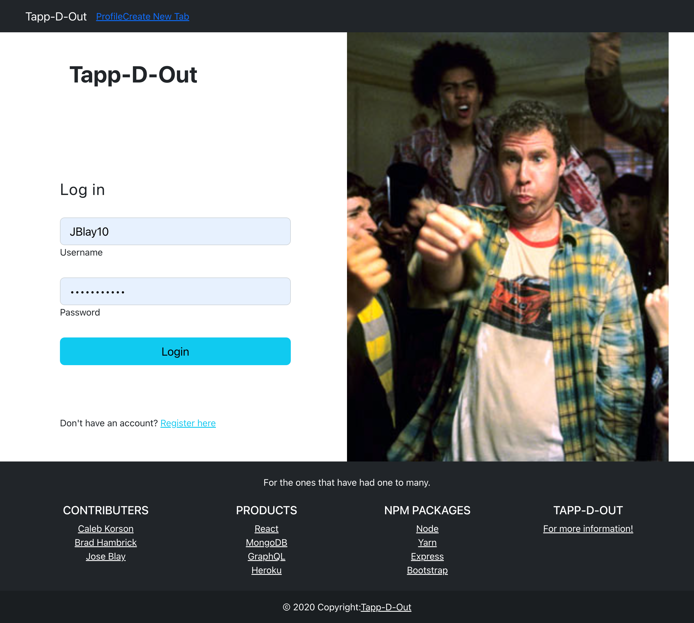
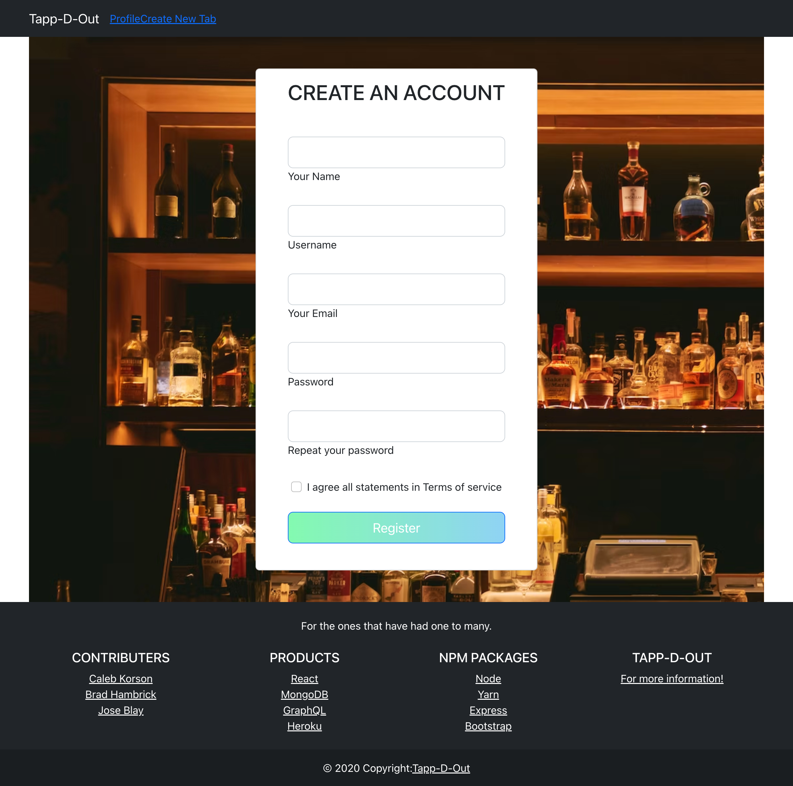
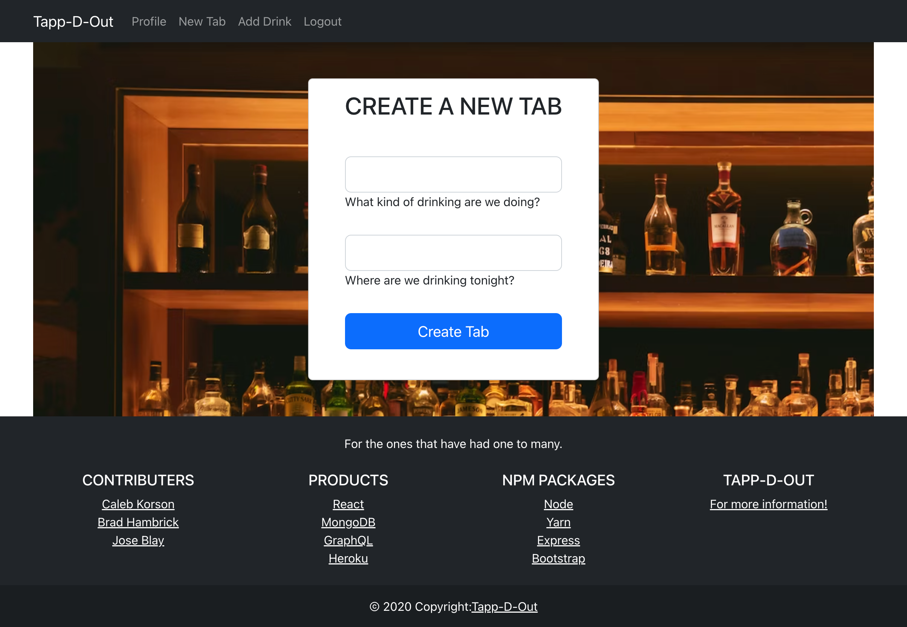
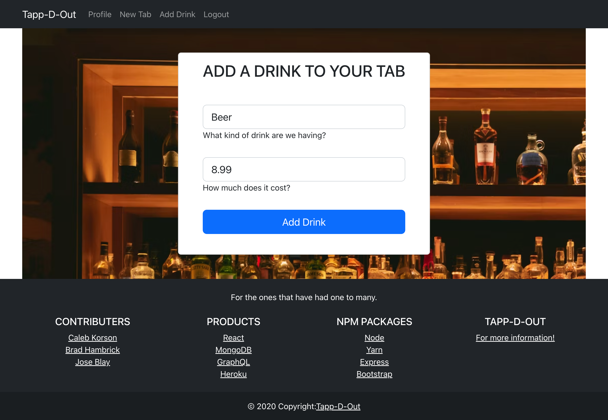

# Tapp-D-Out

<!-- [](https://perso.crans.org/)  -->

Tapp-D-Out is a web app that helps you keep track of your tab in nights out. When you create your account it will take you to your profile where you will be able to add your tab, keep track of your consuption through the night and how much you've spent. If you already have an account created you'll be able to see four of the most recent tabs and a dropdown menu with all the history.  

<!-- []() -->

## Table of Contents

<!-- - [Installation](#installation) -->
- [Usage and Testing](#usage-and-test)
- [Screenshots](#screenshots)
- [Contributers](#contributers)

<!-- ## Installation

In the console under the file that package.json is:
```
npm i
``` -->

## Usage and Test

**After the _npm_ has been installed** 

To initialize server:
```
npm run start:dev
```

## Screenshots


##

##

##

##
 

## Contributers

* Github: 
    - [ckkorson](https://github.com/ckkorson)
    - [Brad Hambrick](https://github.com/Brad-Hambrick)
    - [JBlay10](https://github.com/JBlay10)

